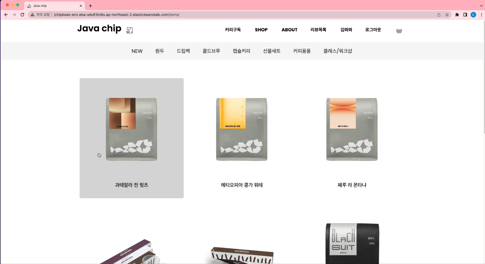
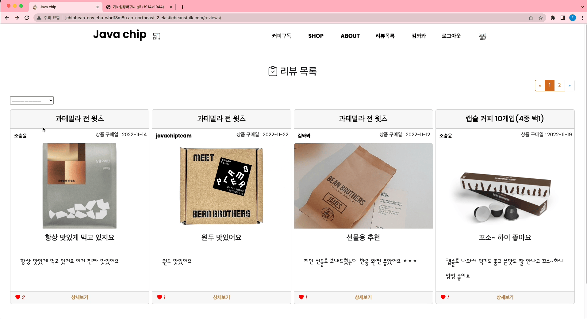

#  Java-chip

## ✅ 프로젝트 소개

### 서비스 이름 ` Java-chip`

### 프로젝트 목표: 빈브라더스 사이트 클론 코딩

### 프로젝트 기간: 2022-11-09 ~ 2022-11-21

### [배포 주소](http://jchipbean-env.eba-wbdf3m8u.ap-northeast-2.elasticbeanstalk.com/)

### [프로젝트 기획서](https://www.notion.so/hg-edu/19-Java-chip-3b19c81899de4278b0e46ce8e4b216e7)

## 🎯 기획 목표

- 커피 정보 및 후기 공유 커뮤니티 서비스 개발

- 수업에서 배운 장고 CRUD, 팔로우, 좋아요, 비동기 기능을 이용한 서비스 개발

## 🎯 프로젝트 목표

1️⃣ 서비스에는 최소 20개의 콘텐츠 정보(여행지, 맛집, 영화, 상품)가 생성된 상태여야 합니다.

2️⃣ 콘텐츠 정보 & 후기 공유 커뮤니티 서비스에 필요한 최소한의 CRUD를 구현해야 합니다.

3️⃣ 회원 인증 기능을 구현하고, 권한에 따라 서비스 사용을 제한해야 합니다.

1. 모든 사용자는 콘텐츠(여행지, 맛집, 영화, 상품)를 조회할 수 있어야합니다.
2. 로그인 한 사용자는 콘텐츠에 후기를 생성할 수 있으며 후기 작성자만 후기를 수정/삭제할 수 있어야합니다.
3. 로그인 한 사용자는 후기에 댓글을 생성할 수 있으며 댓글 작성자만 댓글을 삭제할 수 있어야합니다.

4️⃣ 사용자는 콘텐츠 또는 후기에 좋아요를 남길 수 있어야합니다.

5️⃣ 사용자간 팔로우를 할 수 있어야합니다.

6️⃣ HTML / CSS / JavaScript를 활용해서 웹 사이트를 디자인합니다.

7️⃣ 완성한 서비스는 배포해야하며 발표회에서는 배포된 서비스를 시연해야 합니다.

## 👥 팀원 구성

- 김민찬[Github](https://github.com//kmckmc5587)
- 김태형[Github](https://github.com/riumr)
- 오진수[Github](https://github.com/ericaforcoding)
- 신현강[Github](https://github.com/SHIN-sped) 
- 조승윤[Github](https://github.com/mgpo-98)

---

## 🛠️ 기술 스택

**Frontend**  

**Backend**  

**Distribution**  

---

## 💻 팀원별 상세 구현 기능

### ⭐김민찬⭐
- 프론트엔드
- base/index 페이지
 

### ⭐김태형⭐
- 백/프론트엔드
- Items(상품정보페이지) 앱 담당
  - clone 할 사이트에서 상품정보 crawling
  - 상품 목록 페이지 구현
  - 상품 상세 정보 페이지 구현
  - 장바구니 구현

### ⭐오진수⭐
- 백/프론트엔드
- Accounts 앱 담당
  - 로그인,로그아웃, 회원 정보 수정, 회원 탈퇴 구현 
  - 팔로우/언팔로우 비동기 구현 
  - 마이페이지 구현

### ⭐신현강⭐
- base/index 페이지
 

### ⭐조승윤⭐
- 백/프론트엔드
- Reviews(리뷰페이지) 앱 담당 
 - 리뷰 목록 페이지구현 
   - select 기능 구현
   - 페이지네이션 기능 구현
 - 리뷰 글 작성및 수정 페이지
 - 리뷰 디테일 페이지 
 - 좋아요(비동기) 댓글 기능     

## 🖊기능소개
 

- 메인페이지

        네브바 /  상품 이미지 / 

        네브바 : 로그인 로그아웃 회원가입 장바구니 리뷰목록 상품목록으로 가는 리스트를 보여주며 클릭시 해당 페이지로 넘어간다
    

-  아이템 페이지
    

        아이템 페이지 : 빈브라더스에 있는 상품들을 크롤링을 해서 아이템 상품들을 보여주며 해당 상품 클릭시 아이템 디테일 페이지로 넘어간다

        아이템 디테일 페이지 : 해당 상품에 대한 사진과 주문과 장바구니에 담을수 있는 버튼을 클릭하여 아이템을 주문이 가능하다

        아이템 리뷰 테이블 : 아이템 디테일 페이지 아래에 해당 아이템에 대한 리뷰 테이블을 만들어 해당 아이템의 리뷰를 볼수 있다.

- 회원정보 페이지

        회원가입 후 로그인을 하면 마이페이지를 볼 수 있다.
        
        장바구니 : 아이템을 장바구니에 담아 한번에 총 주문 수량과 총 주문 금액이 계산 가능하며 원하는 아이템을 삭제도 가능하다.

        회원정보 수정/삭제 : 회원정보를 수정 및 삭제할 수 있다.

        작성한 글 : 작성한 글을 카드형태로 보여준다.

        댓글단 글 : 댓글을 단 글을 카드형태로 보여준다.

        좋아요한 글 : 좋아요한 글을 카드형태로 보여준다.

- 리뷰 페이지 
        

        리뷰목록 : 유저들이 작성한 리뷰들을 한번에 볼수 있게 나오고 좋아요순, 최신글 작성순, 상품구매 최신일 순서로 나열이 가능하다.

        리뷰 상세 페이지 : 리뷰에 대한 제목과 내용(사진포함) 그리고 댓글 좋아요 등을 볼수 있으며 회원이름이나 상품 이름 클릭시 해당 페이지로 넘어간다

        리뷰 좋아요 기능 : 좋아요를 누르면 실시간으로 갯수가 올라가며 카운트 된다(비동기로 구현)

        리뷰 댓글 기능 : 댓글을 달수 있으며 실시간으로 몇분전에 댓글 달았는지도 볼수 있으며 본인 댓글시 삭제가 가능하다.

        리뷰 수정 : 리뷰 사진 수정 및 내용 제목 수정이 가능하다.

        리뷰 삭제 : 리뷰 삭제가 가능하다.

---

## 👑 프로젝트 후기 

**김민찬** 기간이 여유로웠는데 생각보다 오래걸렸고, 저번 프로젝트 때보다는 적극적으로 하려 했다. 마지막 기간에 노트북 이슈로 참여하지 못해서 팀원분들께 매우 미안했고, 아쉬웠다. 에러 발생 시 팀원분들과 소통을 통해 고치려는 노력이 굉장히 좋았다.

**김태형** 팀원들과의 소통으로 문제를 해결하는 과정에서 개발과정에서의 협업에 대해 배우고 생각할 수 있었다.또한 프론트엔드부터 백엔드, 배포까지 전체 절차를 진행함으로써 전반적인 개발흐름을 경험할 수 있어 좋았다. 복잡한 기능구현도 의미있었고 기본기능을 많이 구현한 게 도움이 되는 프로젝트였다.

**신현강** 장고 템플릿 적용에 어려움이 있었으나 팀원의 도움으로 이해되었고 자바스크립트 적용에 아쉬움이 남습니다. 기간 내에 역할분담과 구현까지 한 것을 100% 발휘하지 못했지만 진행하면서 배운것이 많았습니다. 모두 취뽀하시길 바랍니다.

**오진수** 처음으로 배포한 사이트인 만큼 개발 과정 중에서 무수히 많은 에러를 만났지만, 사려 깊은 팀원들 덕분에 매 순간이 감사하고 뜻깊은 경험이었다. 이번 프로젝트를 통해 막연히 두렵기만 했던 에러 메시지의 공포를 어느 정도 이겨낸 것 같아 뿌듯하다. 1)JS 기초 학습 2)Axios 공부가 필요하다는 것을 깨달았다. 

**조승윤** 지난 프로젝트를 기반으로 완별한 모델링과 화면 설계로 기간내에 기능을 추가하면서 수행할 계획 이였지만 예상치 못한 오류들과 생각보다 개발이 느리게진행 되어 완벽한 기능을 구현하지 못한거 같아서 아쉬웠다.하지만 저번 프로젝트때 하지못한 기능들을 구현하고 여러 오류를 발견하면서 해결하는 방법을 많이 배우고 팀원들과의 소통의 중요성을 느끼며 다음에는 더욱 빠르게 오류를 해결 할수 있을거 같다.
